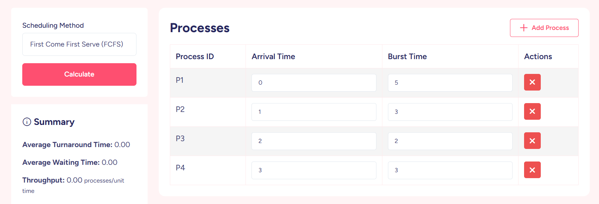

# 📌 CPU-Scheduling-Simulator


**A GUI-based CPU scheduling algorithm simulator with visualization**



## 🌟 Features
- **Feature 1**: Brief description (e.g., "Simulates 6 CPU scheduling algorithms")
- **Feature 2**: With notable technical details (e.g., "Real-time Gantt chart rendering")
- **Feature 3**: Highlight unique value (e.g., "Comparative performance metrics")
- Add and manage multiple processes (Process ID, Arrival Time, Burst Time)
- Select scheduling method (currently supports **First Come First Serve (FCFS)**)
- Calculate:
  - Average Turnaround Time
  - Average Waiting Time
  - Throughput (Processes/unit time)
- Display summary statistics
- User-friendly interface to add or delete processes dynamically
- Real-time results on clicking **Calculate**

## 🚀 Quick Start

### Prerequisites
- Python 3.x
- Tkinter (`sudo apt-get install python3-tk` on Ubuntu)

### Installation
```bash
git clone https://github.com/Abdallah1Atef/CPU-Scheduling-Simulator.git
cd CPU-Scheduling-Simulator
A GUI-based simulator that visualizes and compares different CPU scheduling algorithms. This educational tool helps understand how operating systems manage process execution by simulating:
